[Github Pages](https://pages.github.com) provide a simple way to make a
website using
[Markdown](https://daringfireball.net/projects/markdown/) and
[git](https://git-scm.com).

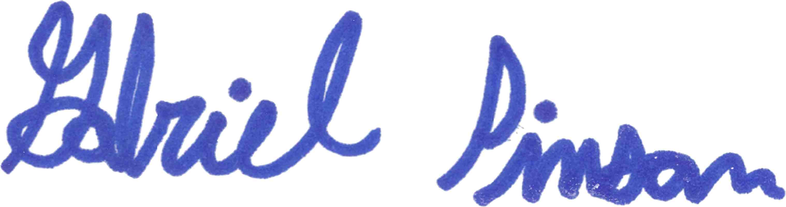 
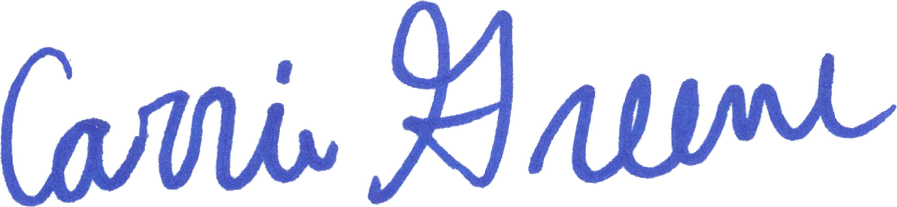
 

 

 
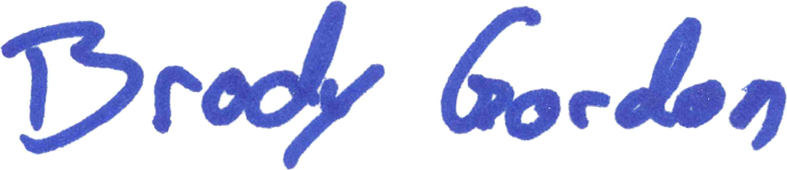
 
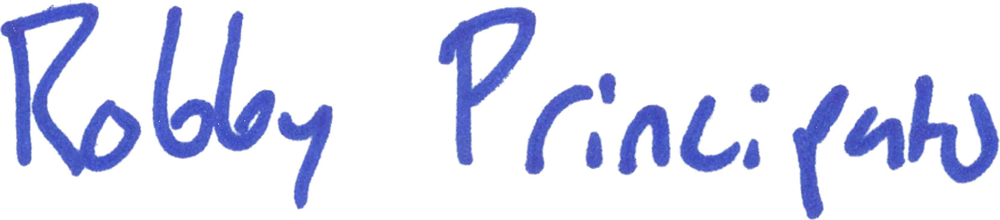
 
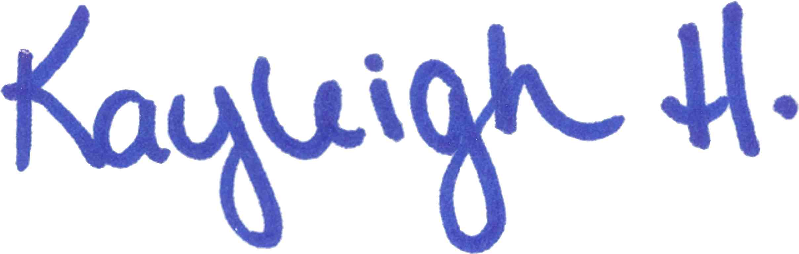
 
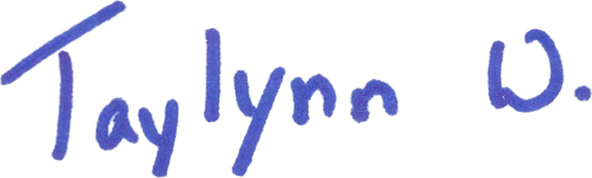
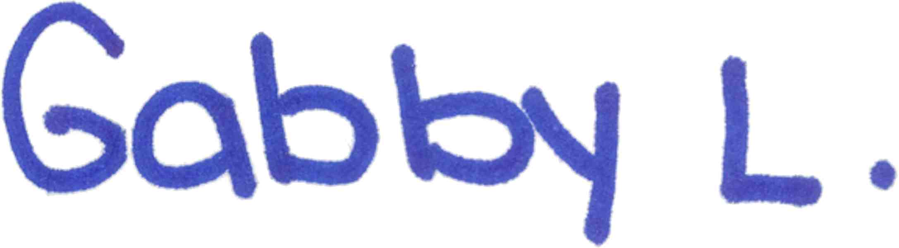 
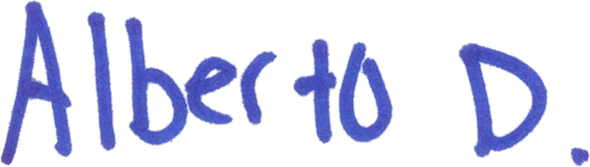
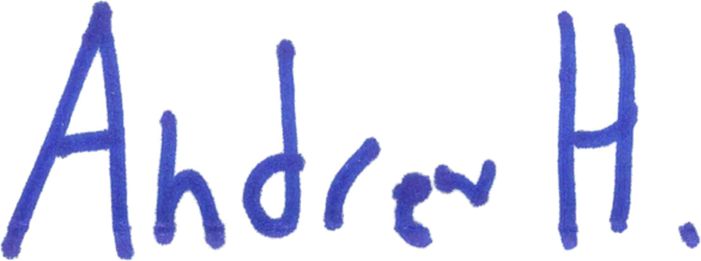 
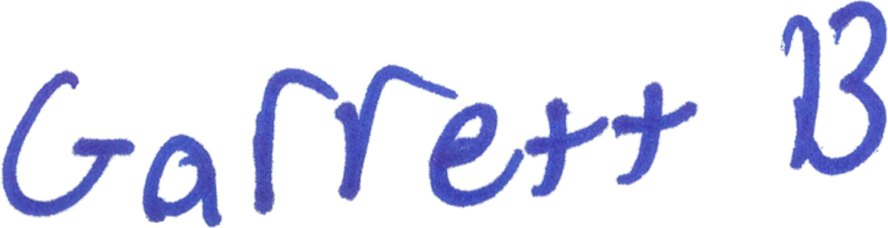
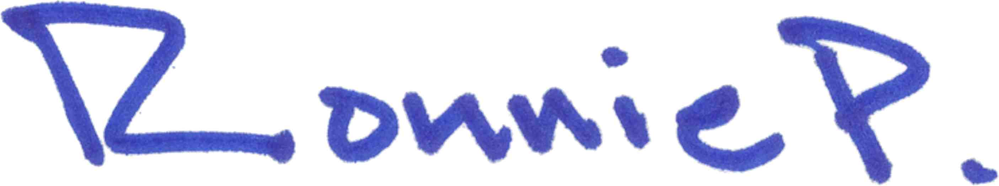 

 

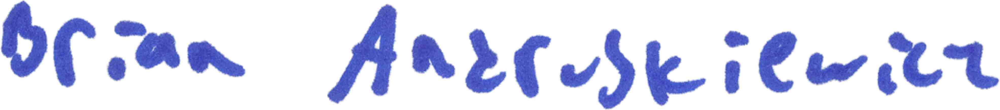 

